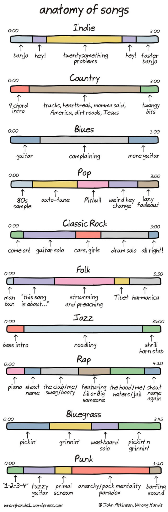
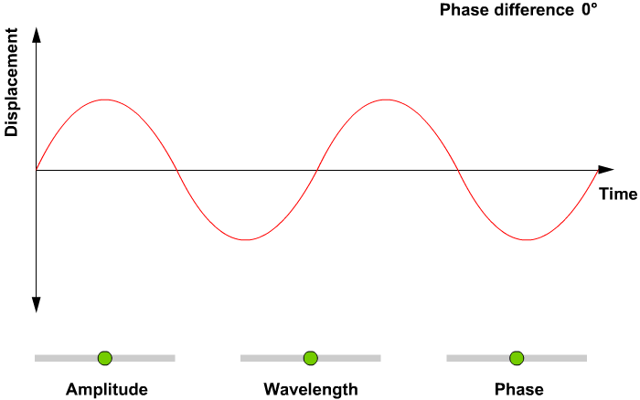

<h2 align='center'>'Melody_Synthesis' is a type of Audio Analysis project using Deep Learning</h2>

Audio data analysis is about analyzing and understanding audio signals captured by digital devices,
with numerous applications in the enterprise, healthcare, productivity, and smart cities. 
Applications include customer satisfaction analysis from customer support calls, media content analysis and 
retrieval, medical diagnostic aids and patient monitoring, assistive technologies for people with hearing impairments, and audio analysis for public safety.

  

<h3><u>Visualizing Audio:</u></h3>

***Plot of the amplitude envelope of a waveform***

